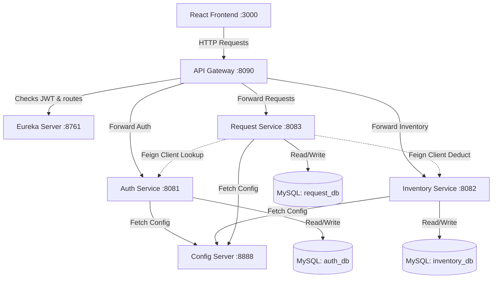
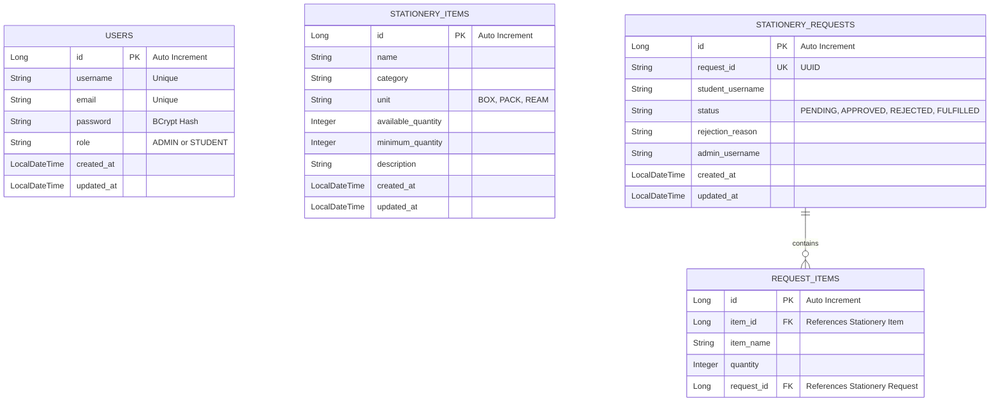

# Stationery Management System - Complete Developer Manual & Documentation

This is a microservices-based web application designed to help a college or organization manage its stationery inventory (such as pens, papers, and desk accessories).

---

## 🏗️ Architecture & Request Flow

The system is built on a distributed microservices pattern. All service settings are centralized, services are auto-discovered, and request routing is secured at the gateway level.



### Infrastructure Summary
1. **Frontend (React):** The client application allowing students to request items and admins to manage inventory and approvals.
2. **API Gateway (Spring Cloud Gateway):** Intercepts all traffic. Validates JWT credentials using a custom `JwtAuthFilter` and appends identity headers (`X-User-Name`, `X-User-Role`) before forwarding requests downstream.
3. **Eureka Server (Service Discovery):** Serves as the service directory, allowing microservices to discover and invoke each other dynamically.
4. **Config Server (Spring Cloud Config):** Holds environment-specific properties (`default`, `dev`, `test`, `prod`) from a native file system directory.
5. **MySQL Databases:** Each microservice owns its separate database instance to ensure true independence.

---

## 🗄️ Database Design (Entity Relationship Diagram)

Each service manages its tables independently. Relational mapping is managed inside the respective Java model classes.



---

## ⚙️ Environment Configurations

The system supports environment-specific profile properties (Dev, Test, Prod) managed through the Centralized Config Server.

| Profile | Target Database | Schema Strategy | Details |
| :--- | :--- | :--- | :--- |
| **`default` / `docker`** | `mysql:3306` | `update` (auto-update) | Default setting for local docker-compose setup. |
| **`dev`** | `localhost:3306` | `update` (auto-update) | For local developer workspace; features verbose SQL logging. |
| **`test`** | `localhost:3306/*_test` | `create-drop` (recreates) | For unit and integration tests; minimal logging. |
| **`prod`** | Production Database | `validate` (strict check) | Strict schema check; credentials and keys injected via environment variables. |

Profile files can be found in the [config-server resources](file:///Users/palak2/Downloads/stationery-management/config-server/src/main/resources/configs).

---

## 📄 API & Endpoint Documentation

The API contract details are documented in the project root: **[api-docs.md](file:///Users/palak2/Downloads/stationery-management/api-docs.md)**.

### Swagger UI & OpenAPI Specification
Each microservice is equipped with **Springdoc OpenAPI**, exposing live documentation.
* **Auth Service Docs:** `http://localhost:8090/api/auth/v3/api-docs` (Swagger UI: `http://localhost:8090/api/auth/swagger-ui.html`)
* **Inventory Service Docs:** `http://localhost:8090/api/inventory/v3/api-docs` (Swagger UI: `http://localhost:8090/api/inventory/swagger-ui.html`)
* **Request Service Docs:** `http://localhost:8090/api/requests/v3/api-docs` (Swagger UI: `http://localhost:8090/api/requests/swagger-ui.html`)

*Note: Access to these endpoints is explicitly bypassed in the Gateway filters and Spring Security to enable public inspection.*

---

## 🚀 Running the Project

### Prerequisites
* Docker and Docker Compose installed.
* Maven 3.9+ and JDK 17 (if running microservices individually).

### Local Quickstart (Docker Compose)
1. Open your terminal in the root project folder.
2. Build and run the docker composition:
   ```bash
   docker-compose up --build -d
   ```
3. Open your browser and go to `http://localhost:3000` to interact with the React interface.
4. **Seed Credentials:**
   * **Admin Console:** Log in with `admin` / `password`.
   * **Student Portal:** Log in with `student` / `password`.

---

## 🤖 CI/CD Pipeline (Jenkins)
The automated pipeline config is defined in the [Jenkinsfile](file:///Users/palak2/Downloads/stationery-management/Jenkinsfile). It executes the following stages sequentially upon code push:
1. **Checkout:** Clones the code.
2. **Build Backend Services:** Runs Parallel Maven compilation (`mvn clean package -DskipTests`).
3. **Run Tests:** Triggers JUnit/Mockito test suites across all modules and aggregates reports.
4. **Build Frontend:** Compiles the React SPA using `npm run build`.
5. **Docker Build:** Builds and tags docker containers for all 7 project services.
6. **Deploy:** Performs rolling docker updates in the deployment environment.
